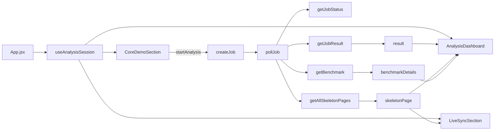
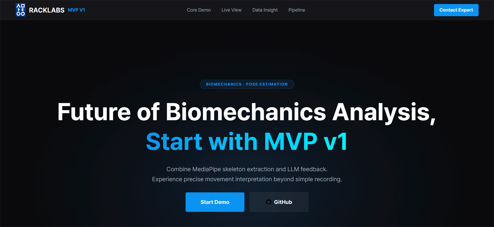
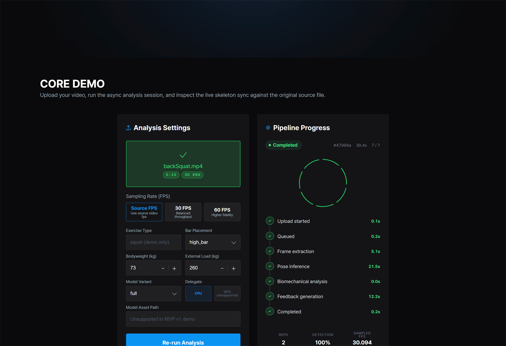
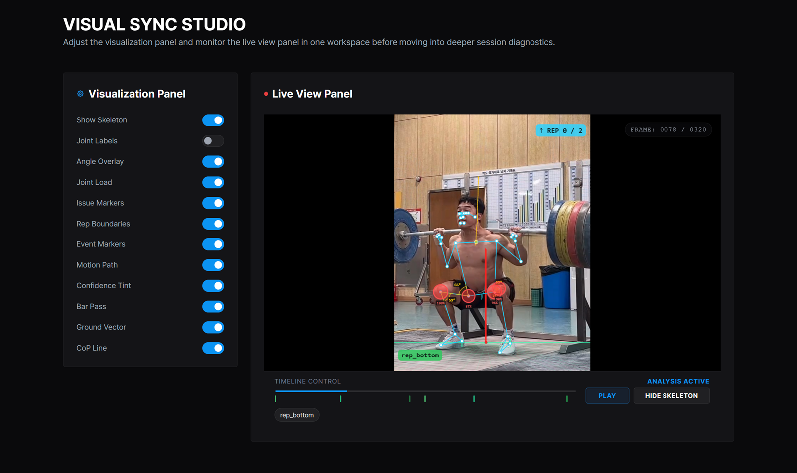
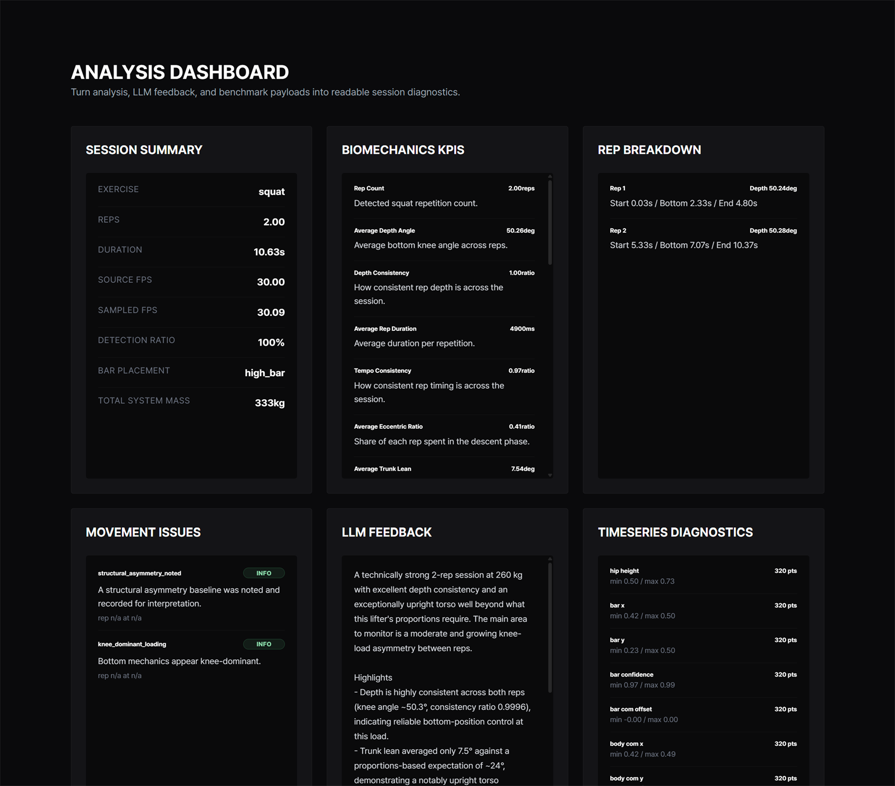
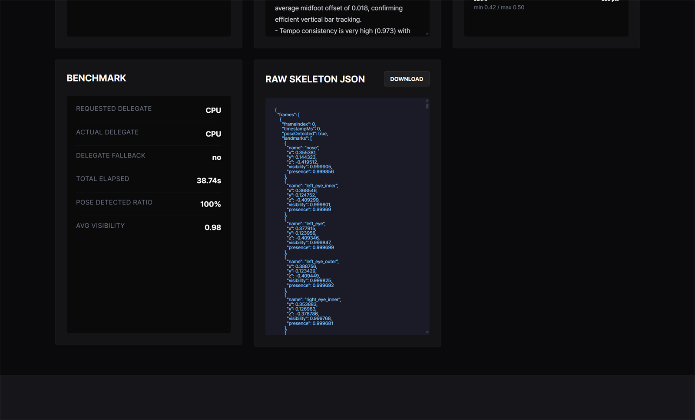
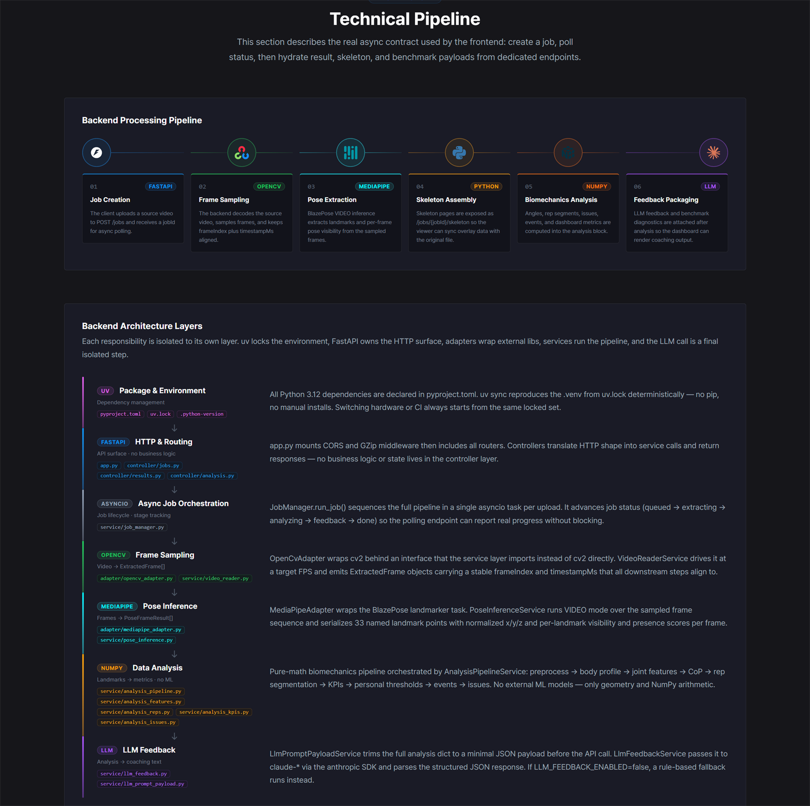
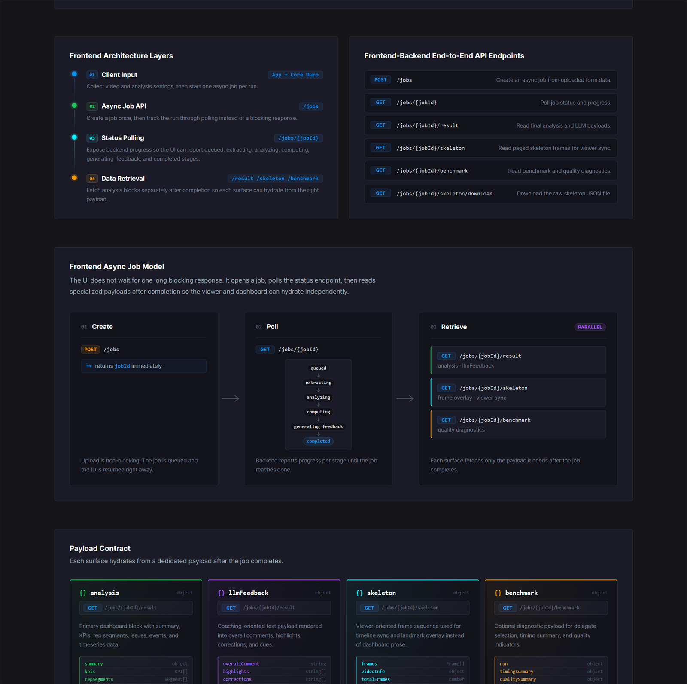
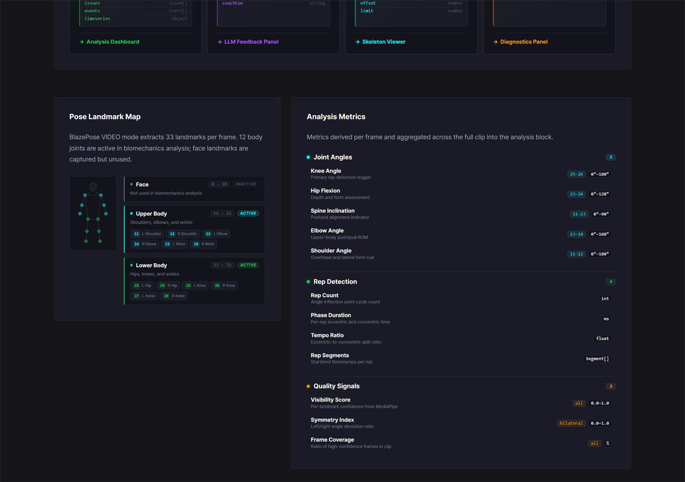
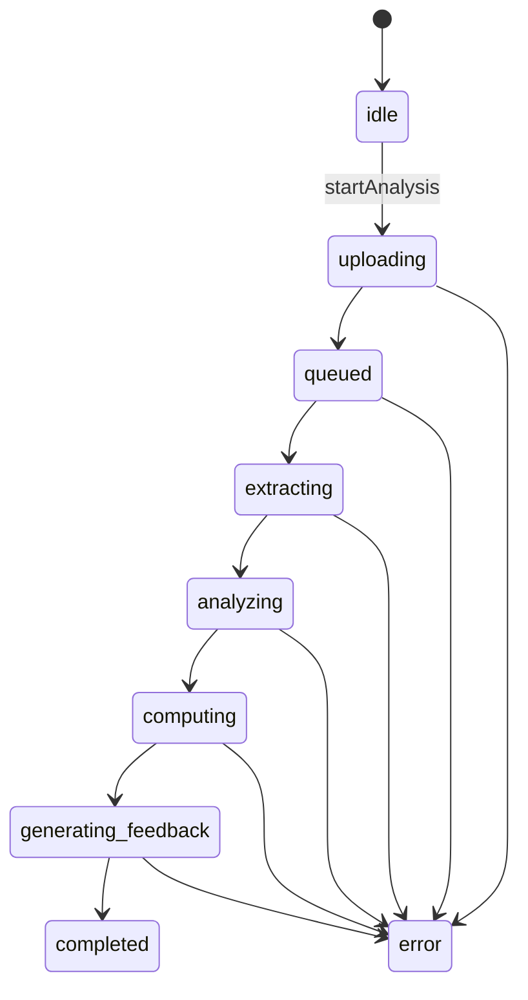

# AI 기반 랙 운동 자세 분석 프론트엔드

> FastAPI 기반 비동기 분석 파이프라인과 연동되는 운동 분석 MVP 프론트엔드입니다.  
> 최신 UI 캡처를 기준으로 섹션 구조, 주요 로직, 훅/상태 관계를 루트 `README`에 정리했습니다.

## 프로젝트 개요

이 앱은 업로드된 운동 영상을 백엔드 분석 파이프라인으로 보내고, 완료 후 다음 세 가지 결과를 하나의 화면에서 다시 조합합니다.

- 스켈레톤 프레임 시퀀스와 오버레이 뷰어
- biomechanics KPI, rep breakdown, issue, timeseries를 담은 대시보드
- LLM 기반 코칭 피드백과 benchmark 진단 정보

현재 런타임의 중심은 [`useAnalysisSession`](app/src/features/analysis-session/useAnalysisSession.js) 하나입니다.  
[`App.jsx`](app/src/App.jsx)에서 이 훅을 한 번 생성한 뒤, `Core Demo`, `Visual Sync Studio`, `Analysis Dashboard` 세 섹션이 동일한 세션 상태를 공유합니다.

## 기술 스택

| 구분 | 사용 기술 |
| --- | --- |
| UI | React 19, Vite 7, CSS Modules |
| 공통 상태 | [`useAnalysisSession`](app/src/features/analysis-session/useAnalysisSession.js) |
| API 통신 | [`analysisClient.js`](app/src/api/analysisClient.js) |
| 데이터 정규화 | [`adapters.js`](app/src/features/analysis-session/adapters.js) |
| 비디오 오버레이 | [`SkeletonViewer`](app/src/components/SkeletonViewer/SkeletonViewer.jsx), [`useVideoSync`](app/src/components/SkeletonViewer/hooks/useVideoSync.js) |
| 타이포그래피 | Pretendard |

## 화면과 코드 대응

| 화면 섹션 | 컴포넌트 | 주요 읽기 상태 | 주요 쓰기 동작 |
| --- | --- | --- | --- |
| Header / Hero | [`MainHeader`](app/src/components/sections/MainHeader/MainHeader.jsx), [`HeroSection`](app/src/components/sections/HeroSection/HeroSection.jsx) | 없음 | `focusCoreDemo()` 호출 |
| Core Demo | [`CoreDemoSection`](app/src/components/sections/CoreDemoSection/CoreDemoSection.jsx) | `form`, `status`, `jobMeta`, `stageMoments`, `result`, `skeletonPage` | `updateForm`, `startAnalysis`, `updateVizConfig` |
| Visual Sync Studio | [`LiveSyncSection`](app/src/components/sections/LiveSyncSection/LiveSyncSection.jsx) | `vizConfig`, `skeletonPage`, `status`, `jobMeta` | `updateVizConfig` |
| Analysis Dashboard | [`AnalysisDashboard`](app/src/components/sections/AnalysisDashboardSection/AnalysisDashboard.jsx) | `result`, `benchmarkDetails`, `skeletonPage`, `jobMeta` | `downloadRawSkeleton()` |
| Technical Pipeline | [`TechnicalPipelineSection`](app/src/components/sections/TechnicalPipelineSection/TechnicalPipelineSection.jsx) | 정적 상수 배열 | 런타임 상태 없음 |

## 런타임 흐름



핵심 포인트는 다음과 같습니다.

- 업로드 이후 UI는 하나의 긴 blocking 응답을 기다리지 않습니다.
- 먼저 `POST /jobs`로 `jobId`를 받고, `GET /jobs/{jobId}`를 adaptive polling 합니다.
- 완료 시점에만 `result`, `skeleton`, `benchmark`를 각 목적에 맞게 따로 hydrate 합니다.
- `completed` 상태도 `result`와 `skeletonPage`가 함께 준비된 뒤에만 노출되도록 설계돼 있습니다.

## 1. Header / Hero



관련 파일

- [`MainHeader.jsx`](app/src/components/sections/MainHeader/MainHeader.jsx)
- [`HeroSection.jsx`](app/src/components/sections/HeroSection/HeroSection.jsx)
- [`focusCoreDemo.js`](app/src/utils/focusCoreDemo.js)

이 섹션은 실제 분석 상태를 다루지는 않지만, 사용자를 `Core Demo`로 유도하는 첫 진입점입니다.

- 상단 네비게이션은 `#coreDemo`, `#liveSyncStudio`, `#dataInsight`, `#technicalPipeline` 앵커에 연결됩니다.
- `Start Demo`와 `Core Demo` 네비게이션 클릭은 모두 `focusCoreDemo()`를 호출합니다.
- `focusCoreDemo()`는 단순 스크롤만 하지 않고, `Analysis Settings` 패널에 포커스를 주고 업로드 영역에 impulse 애니메이션을 걸어 사용자를 바로 입력 지점으로 보냅니다.
- 이 섹션은 세션 상태를 읽지 않으므로, 랜딩 영역과 분석 상태 영역이 느슨하게 분리돼 있습니다.

## 2. Core Demo



관련 파일

- [`CoreDemoSection.jsx`](app/src/components/sections/CoreDemoSection/CoreDemoSection.jsx)
- [`VideoUpload.jsx`](app/src/components/VideoUpload/VideoUpload.jsx)
- [`FpsSelector.jsx`](app/src/components/FpsSelector/FpsSelector.jsx)
- [`useAnalysisSession.js`](app/src/features/analysis-session/useAnalysisSession.js)
- [`adapters.js`](app/src/features/analysis-session/adapters.js)

### 패널 구성

| 패널 | 연결 상태 | 역할 |
| --- | --- | --- |
| `Analysis Settings` | `form`, `validationError`, `userMessage`, `isActive` | 업로드 파일과 분석 파라미터 입력 |
| `Pipeline Progress` | `status`, `jobMeta.progress`, `stageMoments`, `startedAt`, `now`, `result` | 실시간 파이프라인 진행률 표시 |

### 입력 로직

- `VideoUpload`는 파일 선택만 하지 않고, 클라이언트에서 영상 메타데이터를 읽어 `duration`과 source FPS를 추정합니다.
- `FpsSelector`는 `null`, `30`, `60` 세 가지 sampling 전략을 제공합니다.
- 현재 exercise type은 `squat`으로 고정돼 있고, bodyweight / external load / bar placement / model variant를 함께 보냅니다.
- `Delegate`는 UI상 `CPU`만 활성화됩니다.

### 분석 시작 로직

`startAnalysis()`는 다음 순서로 동작합니다.

1. 파일 존재 여부 검증
2. `exerciseType === 'squat'` 검증
3. `bodyweightKg`, `externalLoadKg` 숫자 정규화
4. 이전 run 정리 (`clearRun()`)
5. 로컬 상태를 `uploading`으로 전이하고 `stageMoments.uploading` 기록
6. [`createJob`](app/src/api/analysisClient.js) 호출
7. 응답의 `jobId`로 `pollJob()` 시작

### 진행률 계산 로직

- `Pipeline Progress`는 서버의 `progress`만 그대로 렌더링하지 않습니다.
- [`buildProgressSteps`](app/src/features/analysis-session/adapters.js)가 `stageMoments`와 서버 `stageDurationsMs`를 합쳐 UI용 스텝 모델을 만듭니다.
- 현재 단계가 오래 걸리더라도 ring/step UI가 멈춘 것처럼 보이지 않도록 활성 단계는 시간 기반 점근 fill을 사용합니다.

### adaptive polling

`pollJob()`은 백엔드 부하와 체감 반응성 둘 다 고려합니다.

- 탭이 hidden 상태면 3초 주기
- 실행 45초 초과 시 2.5초
- 실행 20초 초과 시 1.5초
- 초기 3회 미만은 0.5초
- 그 외 기본 1초

완료 시에는 다음 데이터를 병렬/후속으로 가져옵니다.

- `getJobResult(jobId)`
- `getAllSkeletonPages(jobId)`  
  여러 페이지의 skeleton payload를 끝까지 모은 뒤 `mergeSkeletonPages()`로 하나의 `skeletonPage`로 합칩니다.
- `getBenchmark(jobId)`  
  benchmark는 optional 취급이며, 늦게 도착해도 result를 다시 적응시켜 붙입니다.

## 3. Visual Sync Studio



관련 파일

- [`LiveSyncSection.jsx`](app/src/components/sections/LiveSyncSection/LiveSyncSection.jsx)
- [`VisualizationSettings.jsx`](app/src/components/VisualizationSettings/VisualizationSettings.jsx)
- [`SkeletonViewer.jsx`](app/src/components/SkeletonViewer/SkeletonViewer.jsx)
- [`useVideoSync.js`](app/src/components/SkeletonViewer/hooks/useVideoSync.js)

### 패널 구성

| 패널 | 연결 상태 | 역할 |
| --- | --- | --- |
| `Visualization Panel` | `vizConfig` | 어떤 오버레이를 그릴지 토글 |
| `Live View Panel` | `form.videoFile`, `skeletonPage`, `status`, `jobMeta.progress` | 원본 영상 위에 skeleton / marker / diagnostics 오버레이 렌더링 |

### `vizConfig`가 제어하는 것

`Visualization Panel`은 아래 12개 토글을 전부 전역 세션 상태에 씁니다.

- `showSkeleton`
- `showJointLabels`
- `showAngleOverlay`
- `showJointLoad`
- `showIssueMarkers`
- `showRepBoundaries`
- `showEventMarkers`
- `showPathTrace`
- `showConfidenceTint`
- `showBarPass`
- `showGroundVector`
- `showCoP`

### `SkeletonViewer`의 로컬 상태

`SkeletonViewer`는 전역 세션 상태 위에 viewer 전용 로컬 상태를 추가로 가집니다.

| 로컬 상태 | 의미 |
| --- | --- |
| `videoURL` | 업로드한 `File`을 재생 가능한 object URL로 변환한 값 |
| `isPlaying` | 재생/일시정지 상태 |
| `currentTime` | 현재 스크럽 위치 |
| `duration` | 메타데이터 로드 후 비디오 길이 |
| `canvasReady` | 캔버스 크기가 실제 영상 크기에 맞게 준비됐는지 여부 |
| `skeletonHidden` | 전역 `showSkeleton`과 별도로 skeleton만 임시 숨김 |
| `canvasStyle` | letterbox 상황에서도 캔버스가 영상 박스와 정확히 겹치도록 계산한 위치/크기 |

### `useVideoSync()`가 하는 일

이 훅은 `requestAnimationFrame` 루프를 돌면서 매 프레임마다 현재 시점에 맞는 skeleton frame을 찾고 canvas에 그립니다.

- landmark skeleton
- angle overlay
- joint load
- issue marker / event marker
- rep overlay
- path trace
- CoP line
- bar pass 누적 궤적
- ground vector

중요한 구현 포인트

- `vizConfig`와 `barPlacementMode`는 ref로 유지해서 토글 변경이 매번 render loop를 재구성하지 않도록 했습니다.
- `showBarPass`는 offscreen canvas를 별도로 두고 누적 드로잉합니다.
- 뒤로 scrub 하는 경우에는 trail 전체를 다시 그려서 누적 상태가 꼬이지 않게 처리합니다.
- timeline marker는 `timelineMarkers`와 `repSegments`를 조합해 현재 시점과 가까운 이벤트만 강조합니다.

## 4. Analysis Dashboard





관련 파일

- [`AnalysisDashboard.jsx`](app/src/components/sections/AnalysisDashboardSection/AnalysisDashboard.jsx)
- [`LlmFeedback.jsx`](app/src/components/LlmFeedback/LlmFeedback.jsx)
- [`RawSkeletonJson.jsx`](app/src/components/RawSkeletonJson/RawSkeletonJson.jsx)
- [`adapters.js`](app/src/features/analysis-session/adapters.js)

### 패널별 데이터 매핑

| 패널 | 데이터 소스 | 설명 |
| --- | --- | --- |
| `SESSION SUMMARY` | `result.summary`, `skeletonPage.fps` | 세션 전반 요약 |
| `BIOMECHANICS KPIS` | `result.kpis` | KPI 리스트 렌더링 |
| `REP BREAKDOWN` | `result.repSegments` | rep 단위 start/bottom/end와 depth 표시 |
| `MOVEMENT ISSUES` | `result.issues` | severity, rep index, timestamp가 붙은 이슈 패널 |
| `LLM FEEDBACK` | `result.llmView` | overall comment, highlights, corrections, coach cue |
| `TIMESERIES DIAGNOSTICS` | `getTimeseriesSeries(result.timeseries).slice(0, 8)` | 시계열 지표의 min/max와 샘플 수 |
| `BENCHMARK` | `benchmarkDetails` 또는 `result.benchmarkView` | delegate, elapsed time, quality summary |
| `RAW SKELETON JSON` | `skeletonPage.raw` | 원본 skeleton payload 미리보기와 다운로드 |

### adapter가 정리하는 것

[`adaptResult`](app/src/features/analysis-session/adapters.js)는 백엔드 payload를 바로 UI에 쓰기 쉬운 구조로 바꿉니다.

- `analysis`, `llmFeedback`, `benchmark` 분리
- `summary`, `kpis`, `repSegments`, `issues`, `events` 추출
- `llmView` 생성  
  텍스트가 비어 있어도 placeholder-friendly shape 유지
- `benchmarkView` 생성  
  requested/actual delegate, total elapsed, visibility 등 화면용 값만 정리
- `timelineMarkers` 생성  
  viewer에서 바로 쓸 수 있도록 `event`와 `issue`를 공통 포맷으로 변환

### dashboard의 fallback 전략

- result가 없으면 각 패널은 placeholder를 렌더링합니다.
- benchmark가 없더라도 dashboard 전체는 실패하지 않습니다.
- skeleton payload가 없으면 `Raw Skeleton JSON` 패널에서 원인 메시지를 분리해서 보여 줍니다.
- `DOWNLOAD` 버튼은 `jobId`와 skeleton payload가 모두 있을 때만 활성화됩니다.

### skeleton 다운로드 로직

`downloadRawSkeleton(jobId)`는 blob을 받아 object URL을 만들고, 임시 `<a>` element를 클릭해 파일 다운로드를 시작합니다.  
즉, dashboard는 raw payload를 보기만 하는 것이 아니라 실제 디버깅 산출물 추출 지점이기도 합니다.

## 5. Technical Pipeline







관련 파일

- [`TechnicalPipelineSection.jsx`](app/src/components/sections/TechnicalPipelineSection/TechnicalPipelineSection.jsx)

이 섹션은 런타임 상태를 읽는 화면이 아니라, 현재 프론트엔드가 전제하고 있는 비동기 계약을 시각적으로 문서화한 섹션입니다.

### 상수 배열이 그대로 화면이 되는 구조

이 섹션 대부분은 JSX 내부 하드코딩이 아니라 상수 배열을 map 하여 렌더링합니다.

- `PIPELINE_STEPS`
- `BACKEND_ARCH_LAYERS`
- `ARCHITECTURE_LAYERS`
- `API_ENDPOINTS`
- `PAYLOAD_BLOCKS`
- `LANDMARK_GROUPS`
- `ANALYSIS_METRICS_GROUPS`

즉, 이 섹션은 단순 장식이 아니라 현재 프론트엔드가 기대하는 API와 payload shape을 읽을 수 있는 문서 역할을 합니다.

### 이 섹션에서 문서화하는 계약

- `POST /jobs`는 즉시 `jobId`를 반환해야 함
- `GET /jobs/{jobId}`는 queued -> extracting -> analyzing -> computing -> generating_feedback -> completed 흐름을 보고해야 함
- `GET /jobs/{jobId}/result`는 dashboard 성격의 분석 payload를 제공해야 함
- `GET /jobs/{jobId}/skeleton`은 viewer 중심의 frame sequence를 제공해야 함
- `GET /jobs/{jobId}/benchmark`는 optional diagnostics여야 함

## 핵심 훅과 상태 관계

### `useAnalysisSession` 상태 소유권

| 상태 키 | 누가 만든다 | 누가 소비한다 |
| --- | --- | --- |
| `form` | `updateForm()` | `CoreDemoSection`, `SkeletonViewer` |
| `vizConfig` | `updateVizConfig()` | `VisualizationSettings`, `SkeletonViewer` |
| `status` | `startAnalysis()`, `pollJob()`, `hydrateResult()` | `CoreDemoSection`, `LiveSyncSection`, `SkeletonViewer` |
| `jobMeta` | `createJob()` 응답, `getJobStatus()` 응답 | `Pipeline Progress`, `Live View`, `AnalysisDashboard` |
| `result` | `hydrateResult()` | `CoreDemoSection`, `AnalysisDashboard` |
| `skeletonPage` | `getAllSkeletonPages()` + `adaptSkeletonPage()` | `SkeletonViewer`, `AnalysisDashboard` |
| `benchmarkDetails` | `loadBenchmark()` | `AnalysisDashboard` |
| `validationError` / `userMessage` | `startAnalysis()`, `pollJob()` | `CoreDemoSection`, `SkeletonViewer` |
| `stageMoments`, `startedAt`, `now` | `markStage()`, timer effect | `Pipeline Progress` |

### 상태 전이



### 설계상 중요한 점

- `completed`는 status 응답만으로 먼저 노출되지 않습니다.
- 완료 시점에 `resultPayload`와 `skeletonPayload`를 모두 받은 뒤 `hydrateResult()`가 실행됩니다.
- 그래서 viewer와 dashboard가 비어 있는데 status만 `completed`인 반쯤 준비된 상태를 피할 수 있습니다.

## API 계약

현재 [`analysisClient.js`](app/src/api/analysisClient.js)는 기본적으로 아래 엔드포인트를 기대합니다.

| 메서드 | 경로 | 용도 |
| --- | --- | --- |
| `POST` | `/jobs` | 업로드 + 분석 세션 생성 |
| `GET` | `/jobs/{jobId}` | 비동기 진행률 polling |
| `GET` | `/jobs/{jobId}/result` | KPI, rep, issue, llm feedback 조회 |
| `GET` | `/jobs/{jobId}/skeleton` | paged skeleton frame 조회 |
| `GET` | `/jobs/{jobId}/benchmark` | benchmark / quality diagnostics 조회 |
| `GET` | `/jobs/{jobId}/skeleton/download` | raw skeleton JSON 다운로드 |

기본 base URL은 `http://127.0.0.1:8080`이며, `VITE_API_BASE_URL`로 덮어쓸 수 있습니다.

## 주요 디렉터리

| 경로 | 설명 |
| --- | --- |
| [`app/src/components/sections`](app/src/components/sections) | 페이지 단위 섹션 컴포넌트 |
| [`app/src/components/SkeletonViewer`](app/src/components/SkeletonViewer) | 비디오 + canvas sync viewer |
| [`app/src/features/analysis-session`](app/src/features/analysis-session) | 세션 상태와 adapter 로직 |
| [`app/src/api`](app/src/api) | FastAPI 연동 클라이언트 |
| [`docs/readme-images`](docs/readme-images) | 이 README에 삽입한 최신 섹션 캡처 |
| [`docs`](docs) | 기타 아키텍처/작업 로그 문서 |

## 로컬 실행

```bash
cd app
npm install
npm run dev
```

환경 변수 예시

```bash
VITE_API_BASE_URL=http://127.0.0.1:8080
```

## 참고

- 이 README의 스크린샷은 최신 전체 페이지 캡처를 섹션별로 잘라 [`docs/readme-images`](docs/readme-images)에 정리한 것입니다.
- 기존 협업/프로세스 성격의 문서는 계속 [`docs`](docs) 아래에 둘 수 있고, 루트 README는 현재 제품 구조와 구현 설명에 집중하도록 재편했습니다.
