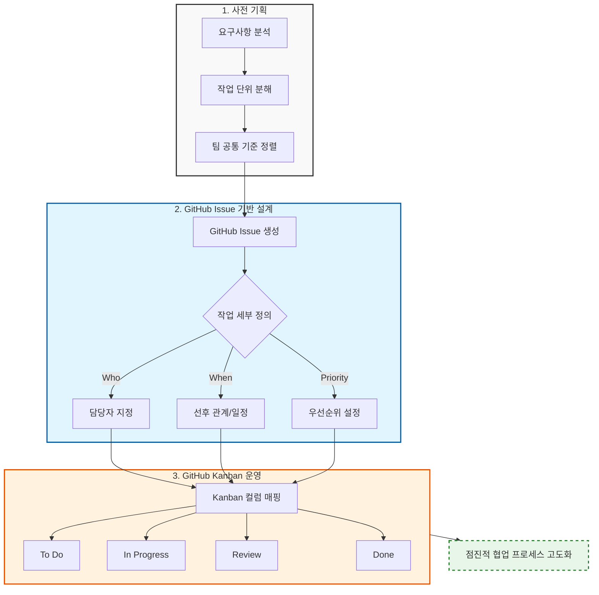
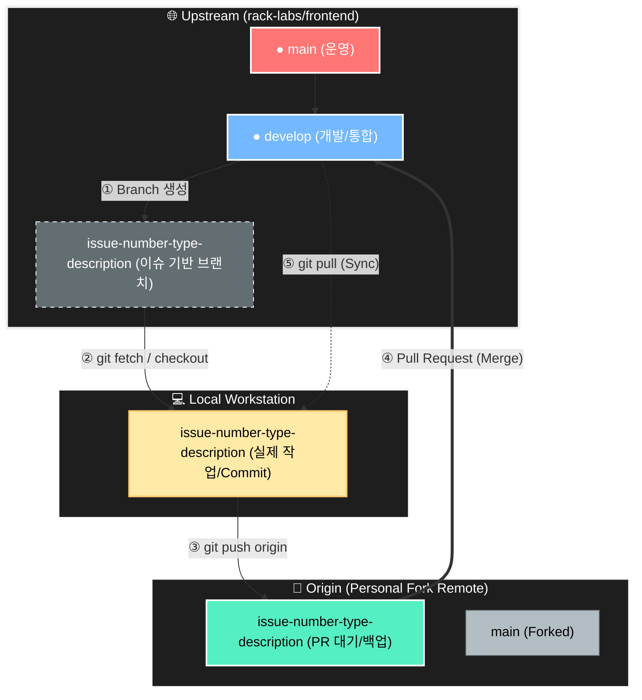
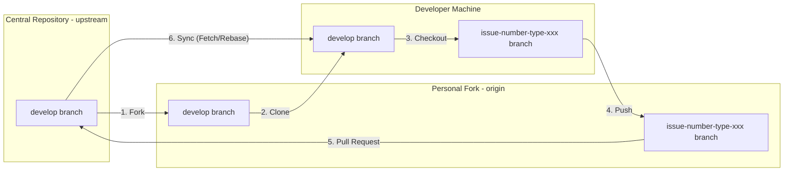
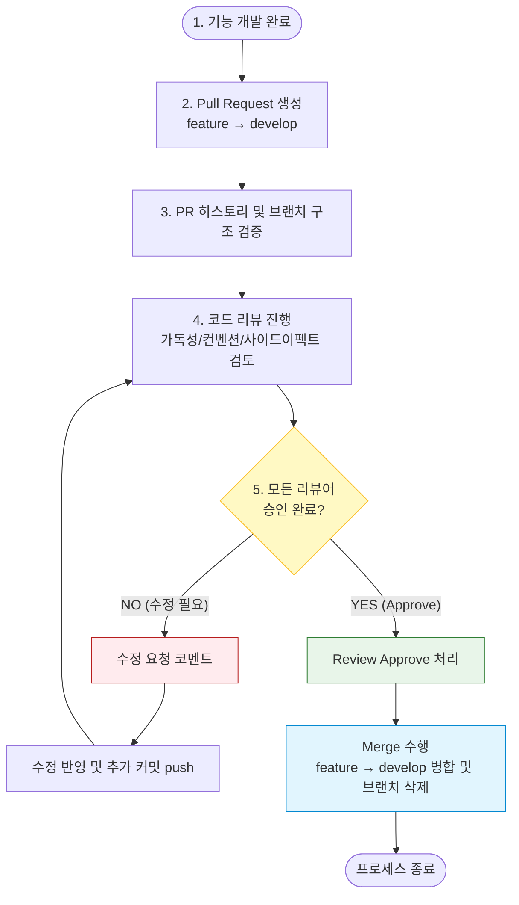
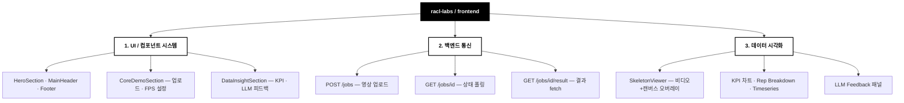
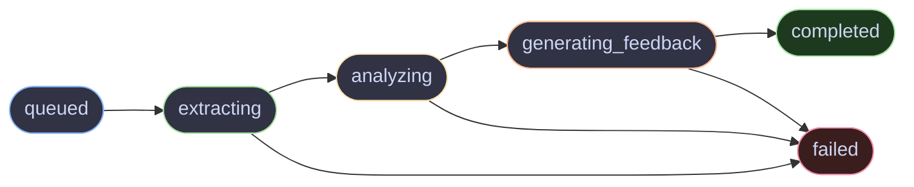

# [AI 기반 랙 운동 자세 분석 — 프론트엔드]

> FastAPI 백엔드와 연동하는 운동 영상 분석 웹앱 (React + Vite)

---

# 팀 구성 및 역할 분담

## 팀원 소개 및 역할

| 프로필 | 이름 | 담당 영역 | 핵심 책임 | 주요 개발 산출물 |
| :---: | :--- | :--- | :--- | :--- |
|  | **이&nbsp;현&nbsp;규** | Frontend / Core | 프로젝트 리드, 프론트엔드 아키텍처 설계 및 구현, 백엔드 API 통신 설계 | 컴포넌트 시스템 구축, SkeletonViewer, API 통합, 문서 체계 수립 |
| — | **이&nbsp;지&nbsp;원** | | | |
| — | **장&nbsp;효&nbsp;인** | | | |
| — | **전&nbsp;효&nbsp;원** | | | |
| — | **신&nbsp;은&nbsp;수** | | | |

---

# 프로젝트 관리 (Collaboration & Process)



> 본 프로젝트는 프론트엔드 기능 구현과 더불어, 이슈 기반 GitHub 협업 시스템을 실제로 설계하고 운영하는 과정을 중점적으로 다룹니다.

---

# 협업 프로세스 (Collaboration Process)

## Collaboration Strategy & Philosophy

### Convention First, Code Later

기능 개발에 앞서 협업의 토대를 먼저 견고히 합니다. 저장소 생성 직후, 브랜치 전략과 커밋 컨벤션을 먼저 확정하고 문서화합니다.

- **브랜치 전략:** 이슈 번호 기반 브랜치 생성, `develop` 브랜치 중심 통합
- **커밋 규칙:** 타입 기반 커밋 메시지로 변경 의도 명확화
- **PR 프로세스:** 모든 변경은 PR을 통해 공유, 리뷰 승인 후 병합

---

# Repository Architecture



> 원본 레포지토리의 안정성을 최우선으로 유지하면서, 개인 단위 자유로운 개발과 팀 단위 통제된 통합을 동시에 달성하기 위한 협업 구조입니다.

---

## Branch Workflow

> 모든 작업은 **`develop` 브랜치**를 기준으로 진행합니다.

| 구분 | 내용 |
| --- | --- |
| **기준 브랜치** | `develop` (Single Source of Truth) |
| **작업 브랜치** | 로컬 환경의 `issue-number-type-short-description` |
| **Push 대상** | `origin` (개인 Fork 레포지토리) |
| **PR 대상** | `origin/작업-브랜치` → `upstream/develop` |



---

### Branch Naming Convention

`<issue-number>-<type>-<short-description>`

| 타입 (Type) | 설명 | 예시 |
| --- | --- | --- |
| `feature` | 새로운 기능 추가 | `1-feature-frontend-first-markup` |
| `fix` | 버그 수정 | `12-fix-skeleton-viewer-crash` |
| `chore` | 설정 변경, 유지보수 등 기능 무관 작업 | `5-chore-vite-config` |
| `docs` | 문서 수정 | `8-docs-update-readme` |
| `refactor` | 기능 변경 없는 코드 구조 개선 | `15-refactor-api-client` |
| `style` | UI/CSS 스타일 수정 | `20-style-hero-section` |

---

### 커밋 컨벤션 (Commit Convention)

```
type: short summary (#<issue-number>)

- change item 1
- change item 2
```

| Type | Description |
| --- | --- |
| `feat` | 새로운 기능 추가 |
| `fix` | 버그 수정 |
| `docs` | 문서 수정 |
| `style` | 코드 포맷, UI/CSS 스타일 수정 |
| `refactor` | 기능 변경 없는 구조 개선 |
| `chore` | 설정, 빌드, 기타 유지보수 작업 |

---

### 코드 리뷰 프로세스



---

# 프로젝트 개요

### 프로젝트 목표와 범위

- 동영상 업로드 → FastAPI 백엔드 분석 → 결과 시각화까지의 단일 페이지 웹앱 구현
- 스켈레톤 오버레이, 운동역학 KPI 대시보드, LLM 피드백 UI 제공
- 이슈 기반 GitHub 협업 프로세스 실습 및 정착

---

### 프로젝트 범위 (Project Scope)



---

### 저장소 구조

| 경로 | 설명 |
| --- | --- |
| `app/src/components/` | 공통 UI 컴포넌트 (Button, Panel, Toggle 등) |
| `app/src/components/sections/` | 페이지 섹션 컴포넌트 |
| `app/src/features/` | 기능 단위 도메인 (analysis-session) |
| `app/src/api/` | FastAPI 통신 클라이언트 |
| `app/src/Styles/` | CSS 변수 토큰 (`main.css`) |
| `docs/architecture/` | 아키텍처 설계 문서 |
| `docs/conventiion/` | 브랜치/커밋/PR 컨벤션 문서 |
| `docs/work-logs/` | 작업 로그 |

---

### Start Here

- 아키텍처 개요: `docs/architecture/context.md`
- 컴포넌트 패턴: `docs/architecture/component-patterns.md`
- API 통합 가이드: `docs/architecture/frontend-api-integration-guide.md`
- 협업 컨벤션: `docs/conventiion/Issue_PR_convention.md`

---

# 프론트엔드 아키텍처 (Frontend Architecture)

> 단일 페이지(Landing), 섹션별 앵커 내비게이션 구조

<div align="center">
  
  <p><em>MVP v1 — Hero · Core Demo · Visual Sync Studio · Analysis Dashboard · Technical Pipeline</em></p>
</div>

```
App
├── MainHeader                    # 로고 / nav(#coreDemo, #dataInsight, #pipeline) / CTA
├── HeroSection                   # 헤드라인, 서브카피, Start Demo / View Tech Docs
├── CoreDemoSection  #coreDemo    # 분석 설정 + Pipeline Progress
│   ├── Panel("Analysis Settings")
│   │   ├── VideoUpload           # 드래그&드롭 업로드 (MP4·MOV / Max 50MB)
│   │   ├── FpsSelector           # Sampling Rate 토글 (30 / 60 / 120 FPS)
│   │   └── Button "Start Analysis"
│   └── Panel("Pipeline Progress")  # Job 상태 단계별 진행 표시
├── VisualSyncStudio              # Visualization Panel + SkeletonViewer
│   ├── VisualizationSettings     # Show Skeleton / Joint Load / Angle Overlay 토글
│   └── SkeletonViewer            # 비디오 + 캔버스 오버레이, 재생 컨트롤, scrubber
├── DataInsightSection #dataInsight  # Analysis Dashboard
│   ├── Session Summary
│   ├── Biomechanics KPIs
│   ├── Rep Breakdown
│   ├── Movement Issues
│   ├── LLM Feedback
│   └── Timeseries Diagnostics
├── TechnicalPipelineSection #pipeline  # 기술 파이프라인 다이어그램
└── Footer
```

---

## 상태 관리 (State Management)

> Zustand 기반 전역 스토어

```ts
type AnalysisStatus = 'idle' | 'uploading' | 'analyzing' | 'done' | 'error'

{
  status: AnalysisStatus
  videoFile: File | null
  jobId: string | null
  skeletonData: SkeletonJSON | null
  analysisResult: AnalysisResult | null
  vizConfig: {
    showSkeleton: boolean   // default: true
    jointLoad: boolean      // default: false
    angleOverlay: boolean   // default: false
  }
}
```

---

## 백엔드 통신 규약 (API Contract)

> FastAPI 백엔드(`rack-labs/rack-tracker`)와 REST 통신

| 엔드포인트 | 설명 |
| --- | --- |
| `POST /jobs` | 영상 업로드 → `job_id` 즉시 반환 |
| `GET /jobs/{job_id}` | 상태 폴링 → `status` 및 현재 단계 반환 |
| `GET /jobs/{job_id}/result` | 최종 결과 JSON 반환 |
| `POST /analysis/preview` | 샘플 영상 기반 동기 즉시 분석 |

### Job State Machine



### 결과 JSON 구조

```json
{
  "skeleton": {},     // 비디오 오버레이 UI용 프레임별 랜드마크
  "analysis": {},     // 대시보드 시각화용 KPI · repSegments · issues
  "llmFeedback": {}  // 코칭 텍스트 패널 (overallComment, highlights, corrections, coachCue)
}
```

---

## 로컬 실행

```bash
# 1. 의존성 설치
cd app
npm install

# 2. 개발 서버 실행 (http://localhost:5173)
npm run dev
```

> 백엔드 서버(`rack-labs/rack-tracker`)가 `http://localhost:8000`에서 실행 중이어야 합니다.

---

## 기술 스택

| 분류 | 기술 |
| --- | --- |
| Framework | React 19 |
| Bundler | Vite 7 |
| Styling | CSS Modules + CSS Variables |
| Font | Pretendard |
| 상태 관리 | Zustand (도입 예정) |
| 백엔드 연동 | REST API (FastAPI) |
